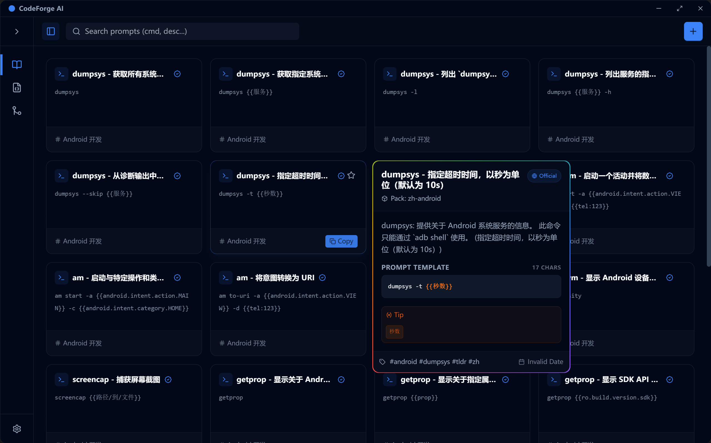
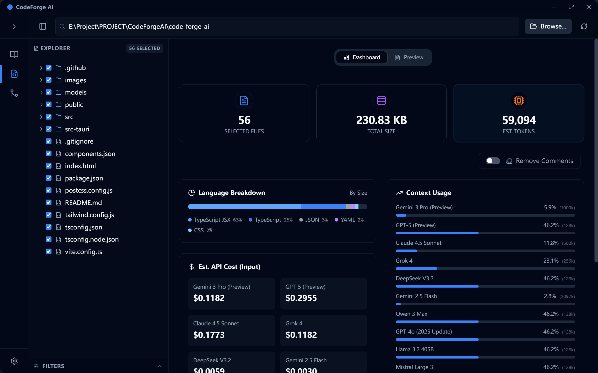
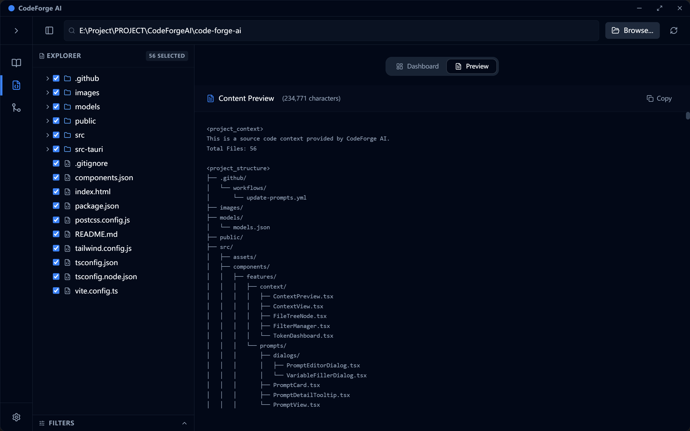
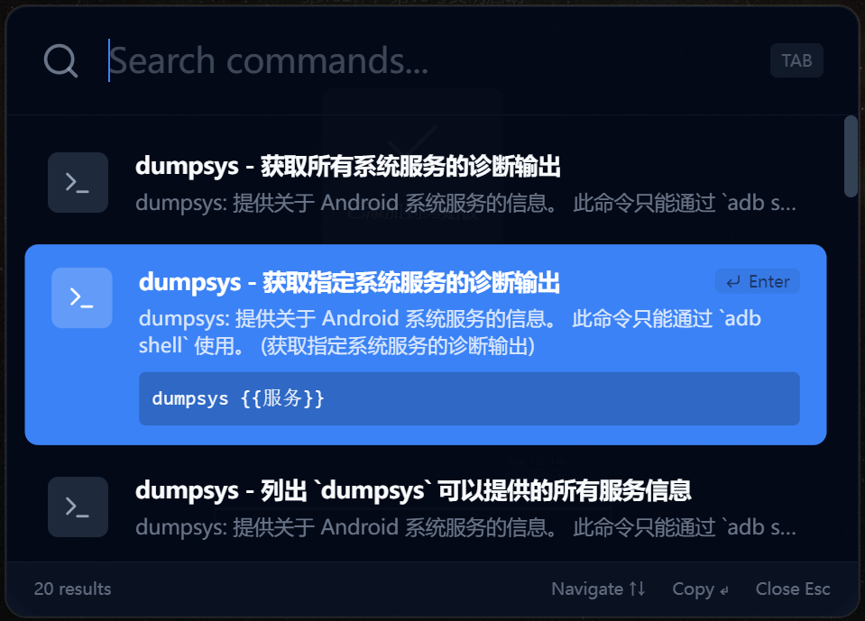
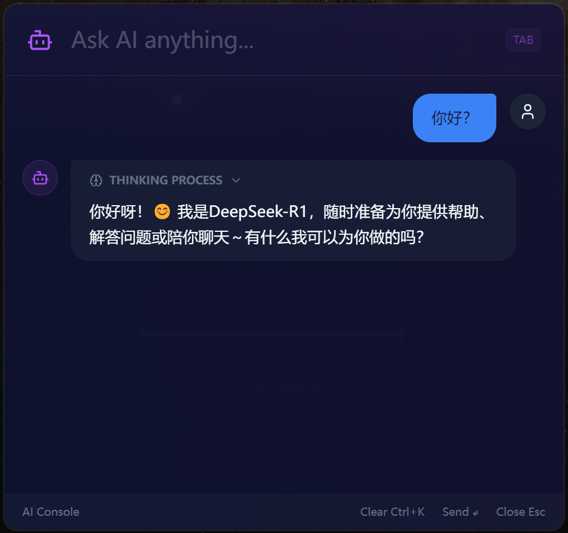

  

  <h1 align="center">CtxRun</h1>

  

    <strong>Run with context, AI at your fingertips.</strong>
     
    AI-Powered Productivity Tool for Developers: Context Assembly · Prompt Management · Global AI Chat · Code Diff
  

  

    
    
    
    
    
  

 

**CtxRun** is an AI-powered productivity tool designed for developers. It integrates code context assembly, code diff, prompt management, and a always-ready global AI terminal, seamlessly connecting your IDE with Large Language Models (LLMs).

## ✨ Core Features

*   **🚀 Context Forge (File Assembly)**: Intelligently package your project files into LLM-friendly formats with automatic comment removal, binary file filtering, and real-time token estimation. Supports configuration persistence and project memory.
*   **💡 Spotlight (Global AI Terminal)**: Summon anytime with global hotkey (`Alt+S`). Quickly search and execute commands, or have streaming AI conversations from any application.
    *   **Calculator**: Type `=1+1`, `=sin(pi)` for quick math
    *   **Shell Commands**: Type `>ls`, `>dir` to execute terminal commands
    *   **Scope Search**: `/app` for apps, `/cmd` for commands, `/pmt` for prompts
    *   **Template AI**: Configure prompts as chat templates for auto-application
    *   **App Launcher**: Search and launch installed applications quickly
*   **📚 Prompt Verse (Prompt Library)**: Efficiently manage your common commands and AI prompts. Supports variable templates, group management, and downloading offline prompt packs from the official library. Supports executable commands and chat template configuration.
*   **🔄 Patch Weaver (AI Completer & Git Diff)**: Apply AI-generated code patches with smart fuzzy matching for precise modification location. Also a powerful Git Diff visualizer with Working Directory comparison, version comparison, and diverse export formats.
*   **🛡️ Privacy Security Scan**: Built-in sensitive information detection engine with whitelist management to prevent API key and other secrets leakage.

> ### 🚀 Want to learn how to use it?
>
> 👉 **[Check out the Detailed Usage Guide](./USAGE_EN.md)**

## 🛠️ Tech Stack

Built with a modern **high-performance desktop application architecture**, balancing minimal resource usage with smooth user experience (~10MB install size, ~30MB memory footprint):

*   **Core**: [Tauri 2](https://tauri.app/) (Rust + WebView2) - Native-level performance with minimal install size, multi-window support.
*   **Frontend**: React 18 + TypeScript + Vite 6 - Modern frontend development experience.
*   **State Management**: Zustand - Lightweight yet powerful state management.
*   **Styling**: Tailwind CSS + tailwindcss-animate - Beautiful UIs built fast.
*   **Icons**: Lucide React.
*   **Database**: SQLite (rusqlite) + Refinery - Local data persistence and migration management.
*   **Editor**: Monaco Editor - VSCode-level code editing experience.

---

## 📥 Download & Installation

Download installers for your OS from the [Releases](../../releases) page, or download the portable version (**CtxRun.exe**) - no installation required, click to run (data stored in `%localappdata%\com.ctxrun`):

*   **Windows**: `.msi` or `.exe`

---

## ⚠️ About Virus Alerts

When launching the app, you may see a **"Windows has protected your computer" (Microsoft Defender SmartScreen)** blue warning window.

**This is normal.** Since CtxRun is an open-source project maintained by an individual without an EV Code Signing Certificate, it will be flagged as "unknown publisher".

**How to run:**
1. In the blue warning window, click **<u>More info</u>**.
2. Click the **Run anyway** button that appears below.

> 🔒 **Security Commitment**: This project is fully open-source, built automatically by GitHub Actions, and contains no malicious code. If you have concerns, feel free to review the source and build it yourself.

## Credits & Open Source Notice

Special thanks to the following projects for data support and inspiration:

*   **[tldr-pages](https://github.com/tldr-pages/tldr)**: Command pack data partially sourced from this project.
*   **[Awesome ChatGPT Prompts](https://github.com/f/awesome-chatgpt-prompts)**: Prompt pack data partially sourced from this project.

---

*CtxRun - Run with context, AI at your fingertips.*
